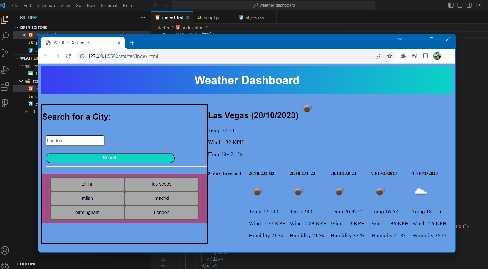

# Weather-Dashboard

## Description

The Weather Dashboard is a web application that allows users to view the weather outlook for multiple cities. 
It provides current weather conditions and a 5-day weather forecast for the specified cities. 
The application retrieves weather data from the OpenWeatherMap API and stores search history using local storage.

## User Story

As a traveler, I want to see the weather outlook for multiple cities so that I can plan my trip accordingly.

## Demo

## URL 
(https://vladslon.github.io/Weather-Dashboard/)

